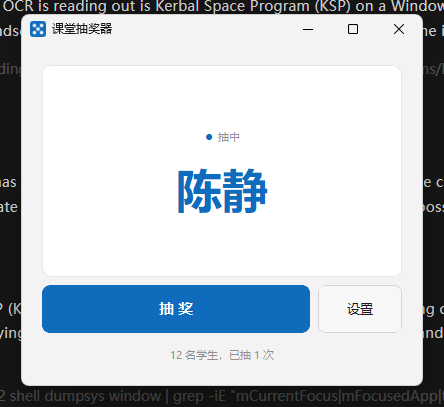

# 课堂抽奖器

随机抽取学生回答问题。点一下「抽奖」直接出结果。



## 使用

**不需要安装 Python**，所有运行库都打包在程序里。

### 方式一：安装包（推荐）

双击 `ClassRoller-4.0.1-setup.exe`，按向导装完即可。

- **按用户安装，不需要管理员权限** —— 学校电脑常常没管理员权限也能装
- 自动创建开始菜单项和卸载程序
- 可选创建桌面快捷方式 / 开机自启
- 装完在「设置 → 应用」或控制面板里可以正常卸载

### 方式二：免安装

解压 `class-roller-4.0.1-win64.zip`，双击 `class-roller\class-roller.exe`。
整个文件夹可以直接拷到 U 盘或别的电脑。

### 开始用

1. 点 **设置** → 「名单」页导入学生名单
2. 点 **抽奖**，直接随机抽出一人

窗口是标准 Windows 窗口：可以拖边框调整大小（尺寸会被记住），
可以最小化、最大化。关闭后程序缩到系统托盘，右键托盘图标可重新打开。

**默认置顶**，投影时不会被其他窗口盖住。可在设置里关掉。

## 配置文件

名单、历史、窗口设置都存在 `config.json` 里，和程序放在同一个文件夹
（**便携模式**）。你可以在设置 →「偏好」页看到它的确切位置，点「打开所在文件夹」
直接跳过去。

这个文件可以用记事本打开、可以备份、可以拷到别的电脑继续用：

```json
{
  "names": ["张三", "李四", "王五"],
  "history": [
    { "name": "张三", "timestamp": "2026-09-10T14:32:11" }
  ],
  "always_on_top": true,
  "avoid_repeat_window": 0,
  "window_width": 400,
  "window_height": 340
}
```

如果程序装在只读位置（比如 `Program Files`），配置会自动改存到
`%APPDATA%\ClassRoller\`。从旧版本升级时，原来存在 `%APPDATA%` 的名单
会自动迁移过来，不会丢。

## 名单格式

每行一个姓名，直接粘贴即可：

```
张三
李四
王五
```

也能识别这些常见格式，不用手动清理：

| 输入 | 解析结果 |
|------|---------|
| `张三,李四,王五` | 三个人 |
| `张三、李四` | 顿号也当分隔符 |
| `1. 张三` / `①李四` | 自动去掉序号 |
| `1.张三 2.李四` | 同行编号自动拆开 |
| `张三（请假）` | 去掉括号备注 |
| `1,张三,男` | 取姓名列，忽略学号和性别 |
| 带「姓名」表头、`#` 注释行 | 自动跳过 |
| `学生李四`、`李名单` | 正常姓名，不会当表头丢弃 |

编码支持 UTF-8（含 BOM）、GBK、GB18030、Big5，Excel 导出的 csv 也能直接读。

**用 AI 整理名单时，复制这段 prompt：**

```
请把下面的内容整理成学生名单，每行一个姓名，不要序号、表头、性别、学号等额外信息，只保留姓名：

[粘贴原始内容]
```

## 界面

- **Win11 原生观感**：DWM 圆角 + 标题栏与画布同色，看起来是系统原生应用
- **统一设计系统**：所有配色、字号、间距、圆角都来自 `theme.py`，
  有测试保证界面代码不写死这些数值
- **应用图标**：蓝底骰子，与界面强调色一致
- **背景效果**：设置 →「外观」可选
  - *不透明*：最清晰，兼容性最好（默认）
  - *半透明*：整窗轻微透明，所有系统可用
  - *液态玻璃*：冷调画布 + 浮起的白色卡片 + 柔和投影，层次通透。
    用视觉设计实现而**不依赖系统模糊**——实测部分 Win11 版本的
    亚克力接口不产生真实模糊，依赖它反而会露出杂乱桌面、文字发虚
- **动效**：抽中时姓名放大落定 + 颜色渐入（280ms），按钮按压反馈（120ms）。
  时长分级、缓动差异化，且**尊重系统「减少动态效果」**——开启该选项后
  所有动画自动停用，直接显示终态
- **高分屏适配**：窗口尺寸按屏幕 DPI 以逻辑单位保存与恢复。150% 缩放的
  投影/笔记本上反复开关也不会越放越大，更不会越出屏幕盖住任务栏；
  多显示器（含副屏在主屏左侧的负坐标）也正确支持

## 功能

- **一键抽奖**：点一下直接出结果
- **随机源**：操作系统级加密熵（CSPRNG），序列不可预测。
- **概率严格相等**：默认模式下每次抽取相互独立，每个人被抽中的概率
  恒为 1/N，与在名单中的位置、顺序、历史都无关。
- **公平抽取（可选）**：开启后一轮之内不重复点名，所有人被抽过一遍
  才重新开始；每一轮的顺序仍是均匀随机排列。适合一节课想点遍全班时使用。
- **高分屏适配**：150% 缩放的投影/笔记本上窗口不再异常放大、不再越过任务栏；
  窗口位置也会被记住
- **历史记录**：自动保存最近 200 次，在设置「历史」页查看
- **默认置顶**：投影时不会被 PPT 盖住，可在设置里关闭
- **窗口尺寸与位置记忆**：拖边框调整后自动记住，下次在原位置打开；
  始终被约束在所在显示器的工作区内（不盖任务栏）
- **托盘常驻**：关闭窗口不退出，随时唤醒

## 开发

```
roller/
├── _version.py      版本号（打包与界面共用）
├── domain/          领域层：模型与抽奖规则，不依赖 UI/IO
│   ├── models.py        Student / Roster / DrawRecord
│   └── draw_service.py  抽奖服务，随机源可注入
├── infrastructure/  基础设施层
│   ├── roster_parser.py  名单文件解析（格式兼容集中在这里）
│   └── config_store.py   配置读写、便携/用户目录选择、旧配置迁移
├── application/     应用层
│   ├── app_controller.py 用例编排
│   └── events.py         事件总线
├── presentation/    表现层（CustomTkinter）
│   ├── main_window.py    主窗口
│   ├── theme.py          配色、字阶、间距刻度、颜色插值
│   ├── window_utils.py   Win11 圆角/无缝标题栏 + 置顶保持器
│   ├── resources.py      图标等资源路径
│   ├── widgets/          结果卡（含淡入动效）
│   └── dialogs/          设置、输入、确认弹窗
└── assets/          app.ico
```

分层规则：`domain` 不 import 其他层；`application` 只依赖 `domain` 和抽象；
`presentation` 通过事件总线订阅状态变化，不直接改业务数据。

设计约束（有测试守着）：界面文件不得写死间距/圆角数字，必须用
`theme.SPACE_*` / `theme.RADIUS_*`；用到的 theme 常量必须真的 import。

### 运行

```bash
python -m roller
```

### 测试

```bash
python tests/test_domain.py            # 领域层
python tests/test_infrastructure.py    # 解析与配置
python tests/test_config_location.py   # 配置位置、便携模式、迁移
python tests/test_import_scenarios.py  # 名单格式矩阵（46）
python tests/test_import_e2e.py        # 导入端到端（20）
python tests/test_presentation.py      # UI 装配、设计约束（需图形环境）
python tests/test_topmost.py           # 置顶行为（需图形环境）
```

### 构建

```bash
python tools/build.py --zip          # 跑测试 + 打包程序 + 生成 zip
python tools/build.py --zip --no-gui-test   # 跳过需要桌面的测试
python tools/build_installer.py      # 打 Windows 安装包（需要 Inno Setup）
python tools/build_installer.py --with-app   # 先构建程序再打安装包
```

或者双击 `build.bat`。

产物：

| 文件 | 说明 |
|------|------|
| `dist/class-roller/` | 完整程序目录（onedir，启动快，无需解压到临时目录） |
| `dist/class-roller-<版本>-win64.zip` | 免安装分发包 |
| `dist/ClassRoller-<版本>-setup.exe` | Windows 安装包（按用户安装，免管理员权限） |

图标重新生成：`python tools/make_icon.py`

### 兼容开关

个别环境下可能与其它程序冲突（输入法、截图/录屏工具、游戏全屏等）。
出现异常时可设环境变量逐项关闭来定位：

| 变量 | 作用 |
|------|------|
| `CR_NO_TOPMOST=1` | 完全关闭置顶 |
| `CR_AGGRESSIVE_TOPMOST=1` | 开启强力置顶（周期抢 z 序以压制 PPT 放映窗口） |
| `CR_NO_DWM=1` | 关闭圆角与标题栏着色 |
| `CR_NO_ICON=1` | 不设置窗口图标 |
| `CR_NO_TRAY=1` | 不创建托盘图标 |
| `CR_NO_TRAY_ON_CLOSE=1` | 关窗即退出，不缩到托盘 |
| `CR_NO_SIZE_MEMORY=1` | 不记忆窗口尺寸与位置 |

关于置顶：默认是**普通模式**（只用系统标准的置顶属性），够用且最稳。
如果需要在 PPT 全屏放映时也压在放映窗口之上，用 `CR_AGGRESSIVE_TOPMOST=1`
开启强力模式——它靠周期性 Win32 调用抢占层级，实测在部分环境有兼容风险，
所以默认不开。另外程序启动后有约 45 秒的窗口守护：若不是用户主动隐藏，
窗口被意外隐藏会自动恢复。

## 许可

[MIT](LICENSE) —— 可自由使用、修改、分发。

## 常见问题

**要装 Python 吗？**
不用。运行库都打包在程序里，安装包或免安装版都能直接在别的 Windows 电脑上跑。

**Windows Defender 提示怎么办？**
程序没有购买代码签名证书，首次运行可能提示"Windows 已保护你的电脑"。
点「更多信息」→「仍要运行」即可。介意的话可以自己用源码构建。

**名单会被上传吗？**
不会。程序完全离线运行，不联网。名单、历史都只存在本机的 `config.json` 里。

**投影/PPT 时被盖住？**
默认已开启置顶。如果连 PPT 全屏放映也要压住，设环境变量
`CR_AGGRESSIVE_TOPMOST=1` 开启强力置顶（详见「兼容开关」）。
